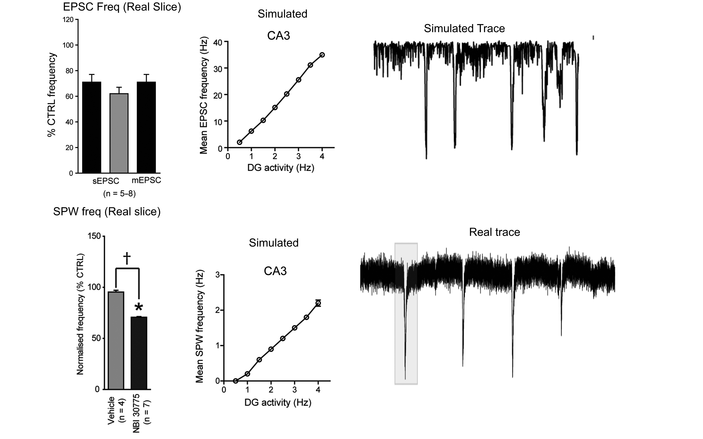

# Conor D. Cox's portfolio
## Compuational modelling

### Project 1: Using Python and Brian2 spiking neural network code to model stress response in hippocampus.

Code can be found at: https://github.com/cdcox/CoxCoxGunnetal2019
Published in: Gunn, Cox et al;  The Endogenous Stress Hormone CRH Modulates Excitatory Transmission and Network Physiology in Hippocampus Cerb Cort, 2019
Model Schematic:

.png) 

Model output, as you can see, the simualted and real traces are similar. Also a decrease in DG frequencey leads to a decrease in EPSC frequency, and a decrease in SPW frequency, a pair of traits found to be linked in actual slices. This allowed us to strengthen the length between these two traits, both of which increase in esponse to stress.

## Computer vision and  Convolutional neural networks

## Big data analysis

## Fun Stuff
